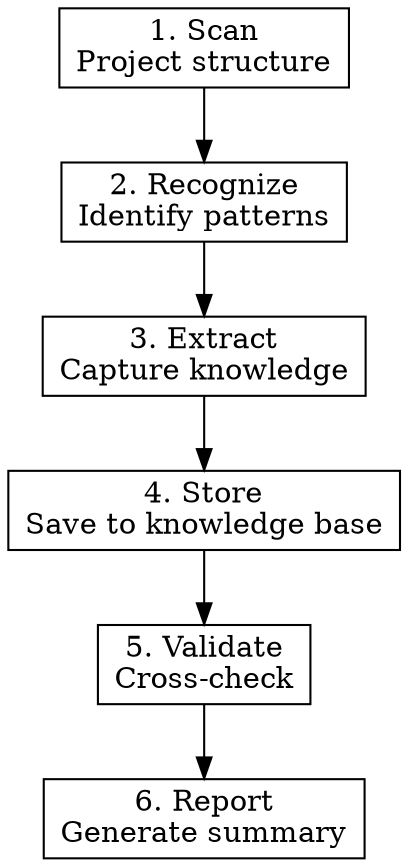

# Meta-Learning: Learning How to Learn

## Overview

Automatically analyze codebases to extract reusable architectural knowledge and design patterns.

**Core principle:** Every codebase contains valuable patterns. Extract them systematically to accelerate future learning.

## When to Use

Use when:
- Encountering a new codebase for the first time
- Need to understand project architecture quickly
- Want to extract reusable patterns from existing code
- Building knowledge base from multiple projects
- Onboarding to unfamiliar tech stack

Don't use when:
- Making quick bug fixes (too heavyweight)
- Already familiar with the codebase
- Project is too small (<100 files) to have meaningful patterns

## The Five-Phase Process



### Phase 1: Project Scanning

**Quick assessment:**

```bash
# File count and size
find . -type f | wc -l
du -sh .

# Tech stack detection
ls package.json Podfile build.gradle 2>/dev/null

# Structure overview
find . -maxdepth 3 -type d | head -20
```

**Output:** Project overview (size, tech stack, structure)

### Phase 2: Pattern Recognition

**Scan for architectural patterns:**

| Pattern | Indicators |
|---------|-----------|
| **MVC** | Separate Model/View/Controller dirs |
| **MVVM** | ViewModel classes, data binding |
| **Clean Architecture** | Domain/Data/Presentation layers |
| **Repository** | Repository classes wrapping data sources |
| **Dependency Injection** | Constructor injection, DI frameworks |

**Scan for design patterns:**

| Pattern | Code signatures |
|---------|----------------|
| **Singleton** | `static let shared`, `private init()` |
| **Factory** | `create*()`, `make*()` methods |
| **Builder** | Fluent interface, `build()` method |
| **Observer** | NotificationCenter, delegates, callbacks |
| **Strategy** | Protocol with multiple conformances |

**Use grep and file inspection systematically.**

### Phase 3: Knowledge Extraction

For EACH discovered pattern:

1. **Capture definition** (what is this pattern?)
2. **Extract code example** (show real usage from project)
3. **Note context** (where and why it's used)
4. **Assess quality** (is this a good implementation?)

**Example output:**

```markdown
## Singleton Pattern

**Definition:** Ensures class has only one instance with global access point.

**Example:**
\`\`\`swift
class NetworkManager {
    static let shared = NetworkManager()
    private init() {}

    func request(_ endpoint: String) { ... }
}
\`\`\`

**Context:** Used for NetworkManager, ConfigurationManager, CacheManager

**Assessment:**
- ✅ Appropriate use (shared stateless service)
- ⚠️  No protocol abstraction (harder to test)
```

### Phase 4: Knowledge Storage

**Save to knowledge base:**

```bash
# Architecture knowledge
.claude/knowledge/architecture/project-name-architecture.md

# Design patterns
.claude/knowledge/patterns/pattern-name.md

# Code snippets (if reusable)
.claude/knowledge/code-snippets/snippet-name.md
```

**File naming:**
- Use kebab-case
- Include date if time-sensitive: `YYYY-MM-DD-topic.md`
- Specific names: `ios-network-layer.md` not `networking.md`

### Phase 5: Cross-Validation

**Compare with existing knowledge:**

```
Is this pattern already documented?
├─ YES: Is new example better?
│  ├─ YES → Update existing doc
│  └─ NO → Add note, don't duplicate
└─ NO: Does it contradict existing knowledge?
   ├─ YES → Flag for review
   └─ NO → Add as new knowledge
```

**Validation checklist:**
- [ ] No duplicate entries
- [ ] Consistent terminology with existing knowledge
- [ ] Cross-references added where relevant
- [ ] Quality bar met (not just "we found this")

### Phase 6: Reporting

**Generate concise report:**

```markdown
# Meta-Learning Report: [Project Name]

## Project Overview
- **Size:** 1,234 files, 56K lines
- **Tech Stack:** Swift, UIKit, Combine
- **Architecture:** MVVM with Coordinator pattern

## Patterns Discovered
1. **MVVM Architecture** - Clean separation of concerns
2. **Coordinator Pattern** - Navigation flow management
3. **Repository Pattern** - Data layer abstraction
4. **Dependency Injection** - Manual DI via constructors

## Knowledge Added
- `architecture/project-mvvm-architecture.md`
- `patterns/coordinator-pattern.md`
- `code-snippets/combine-network-request.swift`

## Key Insights
- Strong architecture foundation
- Good separation of concerns
- Test coverage: ~60% (could improve)

## XP Earned: +40
```

## Quick Reference

| Phase | Key Actions | Duration |
|-------|-------------|----------|
| **Scan** | File count, tech stack, structure | 2 min |
| **Recognize** | Identify architectural and design patterns | 10 min |
| **Extract** | Capture definitions, examples, context | 15 min |
| **Store** | Save to knowledge base with proper naming | 5 min |
| **Validate** | Cross-check against existing knowledge | 5 min |
| **Report** | Generate summary and calculate XP | 3 min |

**Total:** ~40 minutes for medium project (1000-5000 files)

## Common Mistakes

| Mistake | Fix |
|---------|-----|
| **Capturing everything** | Be selective - only capture reusable patterns |
| **Vague descriptions** | Include concrete code examples |
| **Ignoring context** | Document WHERE and WHY pattern is used |
| **Creating duplicates** | Always validate against existing knowledge first |
| **Skipping quality assessment** | Not all patterns are good patterns - note issues |

## Real-World Impact

From previous meta-learning sessions:
- Onboarding time: 2 days → 4 hours (with good knowledge base)
- Pattern reuse: 85% of patterns appear across multiple projects
- Knowledge transfer: Junior devs leverage senior's extracted patterns
- Evolution speed: 3x faster learning with systematic extraction

## Related Skills

- **superpowers:using-git-worktrees** - Use if analyzing on separate branch
- **superpowers:systematic-debugging** - Use if encountered during debugging

## XP Calculation

- Project scanned: +10 XP
- Per architectural pattern discovered: +10 XP
- Per design pattern discovered: +5 XP
- Per high-quality code example: +5 XP
- Report completed: +10 XP

**Example:** Discovered MVVM + 3 design patterns + 4 examples = 10 + 10 + 15 + 20 + 10 = 65 XP
